### building things • solving problems • learning in public

---

## About

I'm **N01SX**, a high school student interested in **Competitive Programming** and **Software Development**.

I like building small systems, experimenting with web technologies, and solving algorithmic problems.
Currently focused on getting stronger at **C++**, **Data Structures & Algorithms**, and practical software projects.

~~~text
N01SX
├── Competitive Programming
│   ├── C++
│   ├── Data Structures & Algorithms
│   └── Problem Solving
├── Software Development
│   ├── Next.js / React
│   ├── Node.js
│   └── Python
└── Linux
    ├── Arch Linux
    └── Hyprland
~~~

## Current Focus

| Area | What I’m working on |
| --- | --- |
| ⚡ Competitive Programming | C++ • algorithms • data structures |
| 🌐 Web Development | Next.js • React • TypeScript |
| 🐍 Python | scripting • data • automation |
| 🐧 Linux | Arch Linux • tooling • customization |
| 🚀 Projects | building, shipping, and improving |

## Tech Stack

---

## Contribution Graph

---

## Projects

Some things I enjoy working on:

- **Web projects** — fast, minimal interfaces with strong visual identity
- **Competitive programming** — algorithms, data structures, and problem solving
- **Linux tooling** — scripts, customization, and developer workflow
- **Game projects** — small experiments that turn ideas into playable systems

> More projects will be added here as they ship.

 

© 2026 N01SX • Built with code, curiosity, and too many late nights.

